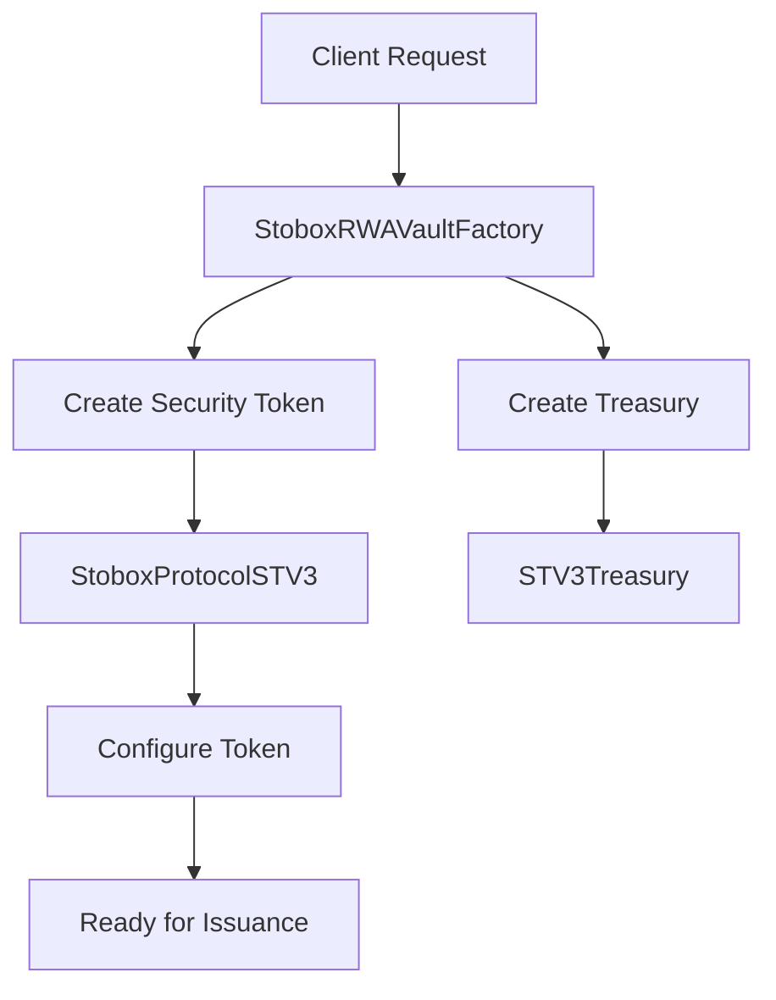
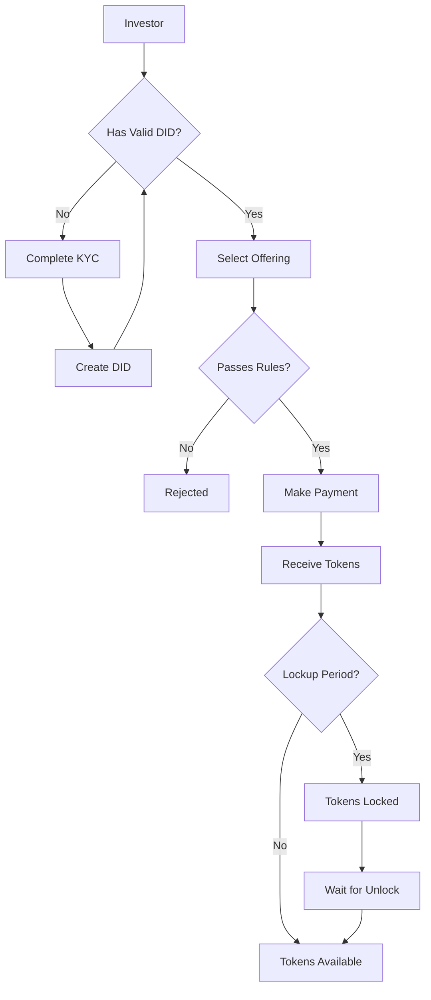
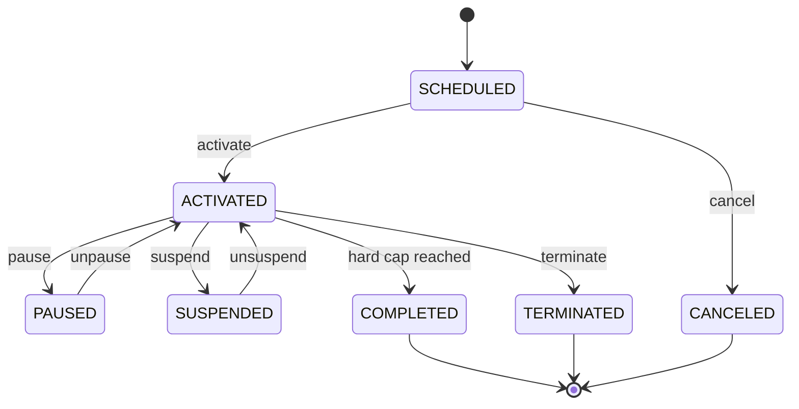

# Diagrams

> Visual representations and flowcharts

---

## Architecture Diagram

<!-- TODO: Add architecture diagram -->

---

## Token Creation Flow

<!-- TODO: Add flowchart -->

---

## Investment Flow

<!-- TODO: Add flowchart -->

---

## Offering Lifecycle

<!-- TODO: Add state diagram -->

---

## Component Interaction

<!-- TODO: Add sequence diagram -->

---

## Role Hierarchy

<!-- TODO: Add hierarchy diagram -->

---

[← Back to Index](./README.md) | [Previous: Compliance and Security](./05-compliance-and-security.md)

